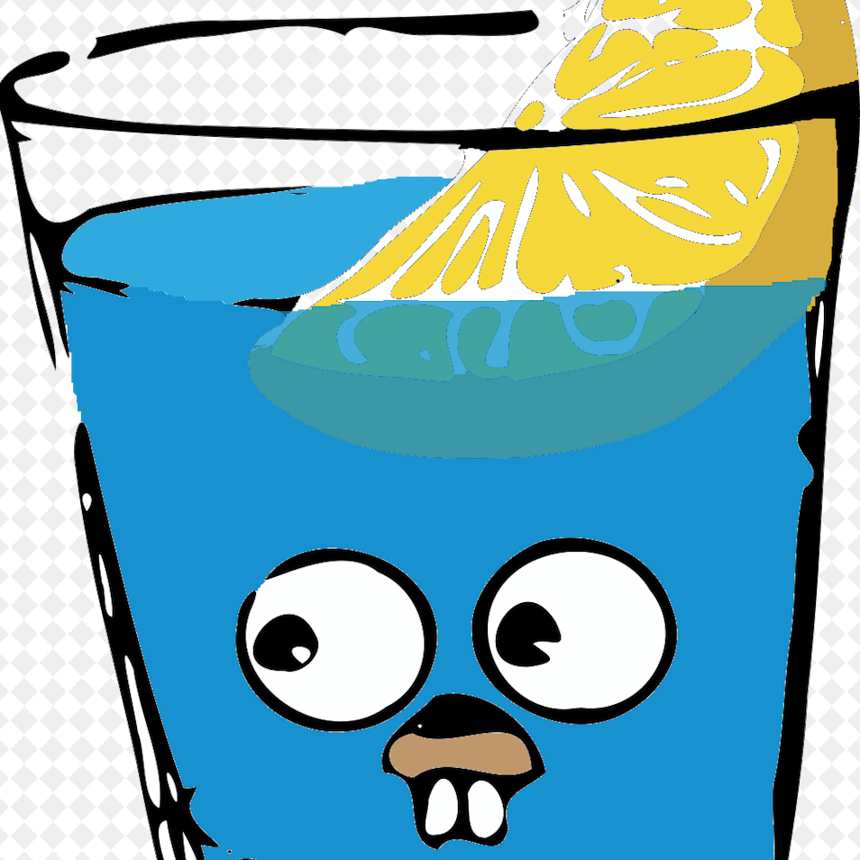

#### spike
<p align="center">

</p>

<p align='center'>

<a href="https://twitter.com/perfactsen"></a>
<a href="https://www.zhihu.com/people/sencoed.com/activities"></a>
</p>

`spike`项目用的是`Golang 1.11.2`版本,本项目采用了go module,配合Golang的web框架gin实现的.

#### Docker
```docker
#母镜像
FROM golang
#维护者信息
MAINTAINER keke
#工作目录
WORKDIR $GOPATH/src/go
#将文件复制到镜像中
ADD . $GOPATH/src/go
#执行操作
RUN go build  main.go
#暴露端口
EXPOSE 8080
#程序入口
ENTRYPOINT ["./main"]
```

然后运行下面的命令把当前编译过项目打进docker镜像:

```bash
> docker build -t spike .

---> 797daa9977c6
Successfully built 797daa9977c6
Successfully tagged main.go:latest
```

```bash
> docker images 
spike                               latest              797daa9977c6        8 minutes ago       801MB
```

表示把项目成功打进docker镜像了.

运行docker镜像:

```bash
> docker run -p 8080:8080 -d spike
```
这样就可以直接docker运行本地镜像启动go项目.

#### go mod使用docker镜像

使用了go mod之后我们可以使用的docker镜像部署go mod的项目,镜像如下:

```dockerfile
#母镜像
FROM golang:latest as build
#维护者信息
MAINTAINER keke

ENV GOPROXY https://goproxy.io/
# go module开启
ENV GO111MODULE on

WORKDIR /go/cache

# 添加go mod
ADD go.mod .
ADD go.sum .

# 构建缓存包含了该项所有的依赖起到加速构建的作用
RUN go mod download

#工作目录
WORKDIR /go/release

#将文件复制到镜像中
ADD . .

# ldflags中-s: 省略符号表和调试信息,-w: 省略DWARF符号表
RUN GOOS=linux CGO_ENABLED=0 go build -ldflags="-s -w" -installsuffix cgo -o spike main.go

# scratch空的基础镜像，最小的基础镜像
# busybox带一些常用的工具，方便调试， 以及它的一些扩展busybox:glibc
# alpine另一个常用的基础镜像，带包管理功能，方便下载其它依赖的包
FROM scratch as prod

COPY --from=build /go/release/spike /

EXPOSE 8080

CMD ["/spike"]
```
这个项目有一些外部依赖，所以在开发的时候都已调整好，并且编译通过，在开发环境已经生成了两个文件go.mod、go.sum.

在dockerfile的中，先启动module模式，且配置代理，因为有些墙外的包服务没有梯子的情况下也是无法下载回来的，这里的代理域名是通用的代理，有需要的也可以用。(这里需要注意下如果是私有仓库的包,可以不配置代理,直接下载拉取即可)

指令`RUN go mod download`执行的时候，会构建一层缓存，包含了该项所有的依赖。之后再次提交的代码中，若是go.mod、go.sum没有变化，就会直接使用该缓存，起到加速构建的作用，也不用重复的去外网下载依赖了。若是这两个文件发生了变化，就会重新构建这个缓存分层。

docker中,go构建命令使用 `-ldflags="-s -w"`,在官方文档：Command_Line里面说名了-s -w参数的意义，按需选择即可。
-s: 省略符号表和调试信息
-w: 省略DWARF符号表

使用scratch镜像,golang:latest开发镜像构建好应用后，在使用scratch来包裹生成二进制程序。

这里关于最小基础镜像，在docker里面有这几类：

* scratch: 空的基础镜像，最小的基础镜像.
* busybox: 带一些常用的工具，方便调试， 以及它的一些扩展busybox:glibc.
* alpine: 另一个常用的基础镜像，带包管理功能，方便下载其它依赖的包.

然后可以运行上面的普通镜像的部署,编译,部署,运行镜像就可以访问和使用了.

看完这个Dockerfile的内容，可能你的第一感觉是不是把之前的两个Dockerfile合并在一块儿了，每个Dockerfile单独作为一个“阶段”！事实也是这样，但这个Docker也多了一些新的语法形式，用于建立各个“阶段”之间的联系。针对这样一个Dockerfile，我们应该知道以下几点：

* 支持Multi-stage build的Dockerfile在以往的多个build阶段之间建立内在连接，让后一个阶段构建可以使用前一个阶段构建的产物，形成一条构建阶段的chain；
* Multi-stages build的最终结果仅产生一个image，避免产生冗余的多个临时images或临时容器对象，这正是我们所需要的：我们只要结果。

多阶段镜像构建可以让开发者通过一个Dockerfile，一次性地、更容易地构建出size较小的image，体验良好并且更容易接入CI/CD等自动化系统。

#### Golang编程

觉得此文章不错，支持我的话可以给我star ，:star:！如果有问题可以加我的微信`Sen0676`,也可以加入我们的交流群一起交流goalng技术！

#### License
This is free software distributed under the terms of the MIT license
